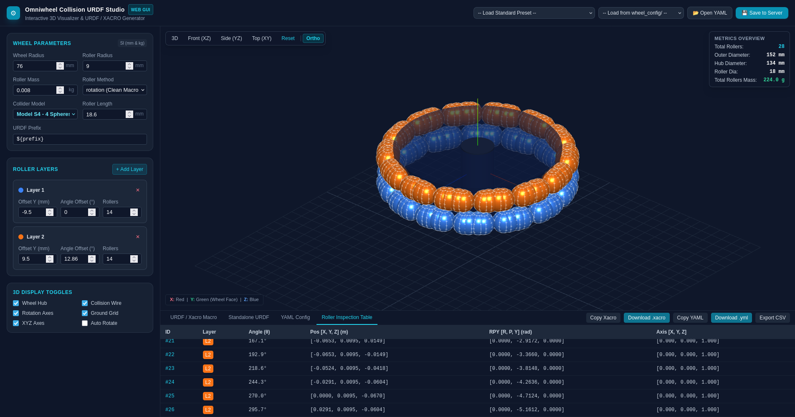

# Omni Wheel URDF Generator & 3D Web Studio

[](https://armmy2530.github.io/Omniwheel-Collision-urdf-Tools/)



> **🚀 Live Web Studio**: Open [https://armmy2530.github.io/Omniwheel-Collision-urdf-Tools/](https://armmy2530.github.io/Omniwheel-Collision-urdf-Tools/) directly in your browser without any installation required!

This repository provides tools and an interactive Web GUI for designing, visualizing, and generating URDF/XACRO collision models for omni-directional wheels with multiple rollers.

## Features

- 🌐 **Interactive 3D Web Studio**: Real-time WebGL/Three.js 3D visualization of wheel hub, rollers (spheres & cylinder barrels), collision wireframes, and rotation axes in orthographic perspective.
- 🔬 **ICRA 2024 Paper Collider Models**: Compound sub-element collider representations based on *"Simulation Modeling of Highly Dynamic Omnidirectional Mobile Robots Based on Real-World Data"*:
  - **Model O (`o11`)**: 11-sphere optimized overlapping envelope with center sphere for smoothest contact and minimal drift.
  - **Model S (`s4`, `s6`, `s8`, `s10`)**: Symmetrical spheres with bearing notch clearance gap (6S recommended for real-time physics performance).
  - **Model C (`c4`, `c7`)**: Segmented concentric cylinders matching roller barrel curvature.
  - **Basic Models**: Single sphere (`sphere`) and cylinder (`cylinder`).
- ⚖️ **Accurate Parallel-Axis Inertia**: Analytical mass distribution and composite inertia tensor calculation $(I_{xx}, I_{yy}, I_{zz})$ for all compound sub-element configurations.
- ⚙️ **Parametric Layer Editor**: Configure multi-layer omni wheels with dynamic offsets, phase angles, and roller counts.
- 📐 **Clean Xacro Macros**: Standard `rotation` method defines collision and inertia once inside `<xacro:macro name="roller">` and reuses it cleanly across all rollers.
- 🤖 **URDF / Xacro Generation**: Instant Xacro collision macro snippet or complete standalone URDF model ready for ROS, Gazebo, and RViz.
- 📦 **Pixi Package Management**: Reproducible environment and tasks managed with [pixi](https://pixi.sh).
- 💾 **Presets & YAML Management**: Built-in industry and paper presets, plus upload/save YAML configs.

---

## Quick Start with Pixi

### 1. Launch the Web Studio GUI

Run the web visualizer application with:

```bash
pixi run start
# or
pixi run gui
```

Open your browser at **`http://localhost:8000`** to access the interactive 3D visualizer and generator.

### 2. Available Pixi Tasks

| Task | Command | Description |
|------|---------|-------------|
| **Start Web GUI** | `pixi run start` | Launches web visualizer on port 8000 with auto-reload |
| **Generate URDF** | `pixi run create-urdf` | Generates URDF collision model from YAML to `output.txt` |
| **Generate YAML** | `pixi run gen-yaml` | Generates wheel YAML config file |

---

## Architecture & File Structure

```
.
├── pixi.toml                         # Pixi package & task configuration
├── cli.py                            # Unified CLI tool
├── web/
│   ├── app.py                        # FastAPI web server & REST API
│   └── static/
│       ├── index.html                # Web GUI interface
│       ├── css/style.css             # Robotics CAD styling
│       └── js/app.js                 # Three.js 3D engine & reactive UI
├── core/
│   └── omni_generator.py             # Shared calculations & URDF logic
└── wheel_config/
    ├── example.yaml                  # Example configuration template
    └── omni_wheel_config.yml         # Active configuration file
```

---

## CLI Usage (Alternative to Web GUI)

You can also use the unified `cli.py` directly or through Pixi:

### 1. Generate URDF / Xacro Snippet

```bash
pixi run create-urdf
# or specify custom input & output:
pixi run python cli.py create-urdf wheel_config/example.yaml -o custom_output.urdf
```

To generate a full standalone robot URDF (viewable in RViz):
```bash
pixi run python cli.py create-urdf wheel_config/omni_wheel_config.yml --standalone -o standalone_wheel.urdf
```

### 2. Generate YAML Configuration

```bash
pixi run gen-yaml
# or with a preset:
pixi run python cli.py gen-yaml --preset standard_dual_layer -o wheel_config/standard.yml
```

### 3. Launch Web GUI via CLI

```bash
pixi run python cli.py gui --port 8080 --reload
```

---

## Output Format

The generated URDF configuration includes:
- Roller position and orientation data
- XACRO macros for roller definition
- Individual roller joint configurations

Example output structure:
```xml
<xacro:roller prefix="${prefix}" num="1">
    <origin xyz="0.055750 -0.012000 0.000000" rpy="0.000000 0.000000 0.000000" />
    <axis xyz="0.000000 0.000000 1.000000" />
</xacro:roller>
```

---

## Notes

- All measurements are in SI units (meters, radians) in code, with millimeters (mm) displayed in the Web GUI for convenience.
- The visualization tool shows the wheel facing along the Y-axis.

---

## GitHub Pages Deployment

The Web Studio is 100% client-side compatible and hosted automatically via GitHub Pages.

To enable GitHub Pages in your repository:
1. Go to **Settings** > **Pages** in your GitHub repository.
2. Under **Build and deployment** > **Source**:
   - **Recommended (Automated)**: Select **GitHub Actions**. The included workflow [`.github/workflows/deploy-pages.yml`](.github/workflows/deploy-pages.yml) will build and deploy automatically on every push to `main`.
   - **Alternative (Branch)**: Select **Deploy from a branch** -> Branch: `main`, Folder: `/docs` -> Click **Save**.
3. Your app will be live at `https://<username>.github.io/Omniwheel-Collision-urdf-Tools/`.